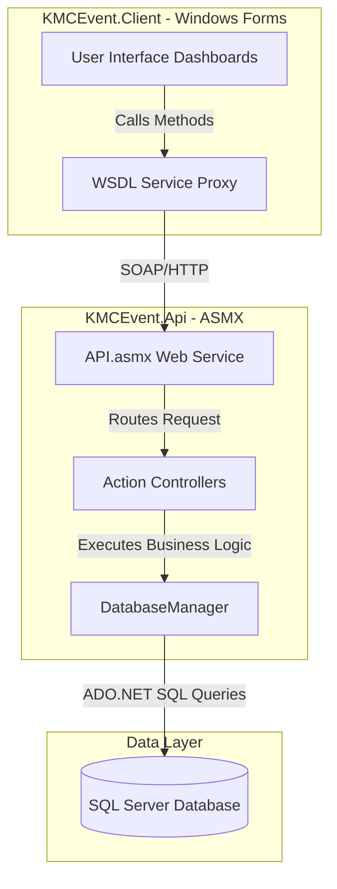
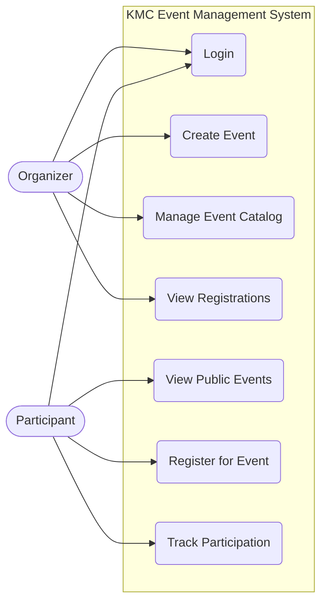
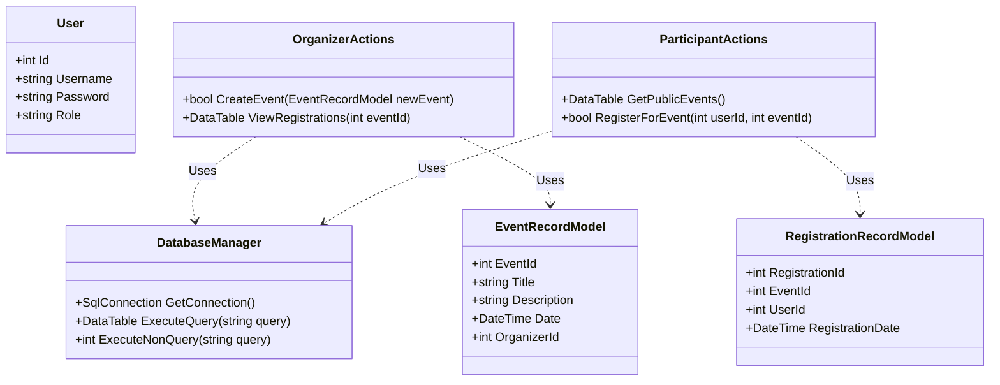

# Task 2: Service-Oriented Computing (SOC) Application Design and Development

## 1. Introduction
This document outlines the design, architecture, and implementation details of the Service-Oriented Computing (SOC) application developed for this case study. The solution comprises a backend service (`KMCEvent.Api`) and a client application (`KMCEvent.Client`) that consumes these services. The architecture prioritizes separation of concerns, reusability, and maintainability.

## 2. Architectural Design
The application follows a Service-Oriented Architecture (SOA) pattern, separating the business logic and data access from the user interface.

### 2.1 Component Overview
*   **Service Provider (`KMCEvent.Api`)**: Contains the core business logic, exposed as web services (ASMX). It handles database interactions, validation, and processing.
    *   *Controllers*: `EventCatalogActions`, `OrganizerActions`, `ParticipantActions` handle specific domains.
    *   *Models*: `EventRecordModel`, `RegistrationRecordModel`, `User` represent data entities.
    *   *Data Access*: `DatabaseManager` manages database connections and queries.
*   **Service Consumer (`KMCEvent.Client`)**: A Windows Forms application that provides an intuitive user interface. It connects to the API via connected services (WSDL) and does not interact directly with the database.
    *   *Dashboards*: `OrganizerDashboard`, `ParticipantDashboard`, `PublicEventsDashboard`.
    *   *Authentication*: `LoginWindow`.

### 2.2 Design Diagrams
Below are the UML diagrams representing the system's architecture, use cases, behavior, and structure.

#### System Architecture / Component Diagram


#### Use Case Diagram


#### Sequence Diagram (Event Registration Example)
```mermaid
sequenceDiagram
    actor Participant
    participant Dashboard as ParticipantDashboard (Client)
    participant API as API.asmx (Service)
    participant Controller as ParticipantActions
    participant DB as DatabaseManager

    Participant->>Dashboard: Select Event & Click Register
    Dashboard->>API: RegisterForEvent(userId, eventId)
    API->>Controller: ProcessRegistration(userId, eventId)
    Controller->>DB: ExecuteNonQuery(INSERT INTO Registrations...)
    DB-->>Controller: Return Success/Failure
    Controller-->>API: Return Result Status
    API-->>Dashboard: Return Confirmation
    Dashboard-->>Participant: Display Success Message
```

#### Class Diagram (Core Components)


## 3. Implementation Details and Coding Standards

### 3.1 Service Implementation (`KMCEvent.Api`)
The service layer is designed with strict adherence to the Single Responsibility Principle. 
*   **Data Models**: Clean C# classes (`User`, `EventRecordModel`) encapsulate the data structure, separate from business logic.
*   **Controllers**: Logic is divided into specialized action classes rather than one monolithic file. For instance, `ParticipantActions` handles only participant-related operations.
*   **Database Management**: The `DatabaseManager` centralizes SQL connection handling, promoting reuse and making it easier to maintain or swap the underlying database technology.

### 3.2 Client Application (`KMCEvent.Client`)
The client application provides a user-friendly and intuitive interface.
*   **Service Consumption**: The client uses generated proxies from the WSDL to communicate with the `KMCEvent.Api`. This abstracts the network communication, allowing UI developers to interact with the service as regular C# objects.
*   **Role-Based UI**: Upon successful login, users are directed to specific dashboards (`OrganizerDashboard` vs `ParticipantDashboard`), ensuring they only see features relevant to their role.

### 3.3 Coding Standards and Documentation
*   **Naming Conventions**: PascalCase is used for classes, methods, and properties; camelCase for local variables, adhering to standard C# guidelines.
*   **Code Comments and Documentation**: All public methods and complex logic blocks are heavily commented using XML documentation tags (`<summary>`, `<param>`, `<returns>`) to clearly define the APIs and interfaces.
*   **Error Handling**: Exception handling is implemented to gracefully catch errors at the service layer and return meaningful messages to the client, preventing application crashes.

## 4. Reusability and Maintainability
The design choices prioritize long-term maintainability:
*   **Clear Separation of Concerns**: By disconnecting the UI from the database, the client application can be updated or even completely rewritten (e.g., to a web or mobile app) without altering the core business logic in the API.
*   **Modular Code**: Breaking the API logic into specific controllers (`OrganizerActions`, `ParticipantActions`) means that future enhancements to one module carry low risk of breaking another.
*   **Well-Documented Interfaces**: The use of standard web services (ASMX/WSDL) creates a strict contract. As long as the interface remains consistent, the backend implementation can be optimized or changed independently.

## 5. Conclusion
The developed SOC application is a highly modular, reusable, and maintainable solution. All required functionalities work seamlessly across the network boundary, providing a robust foundation for future enhancements and scaling.